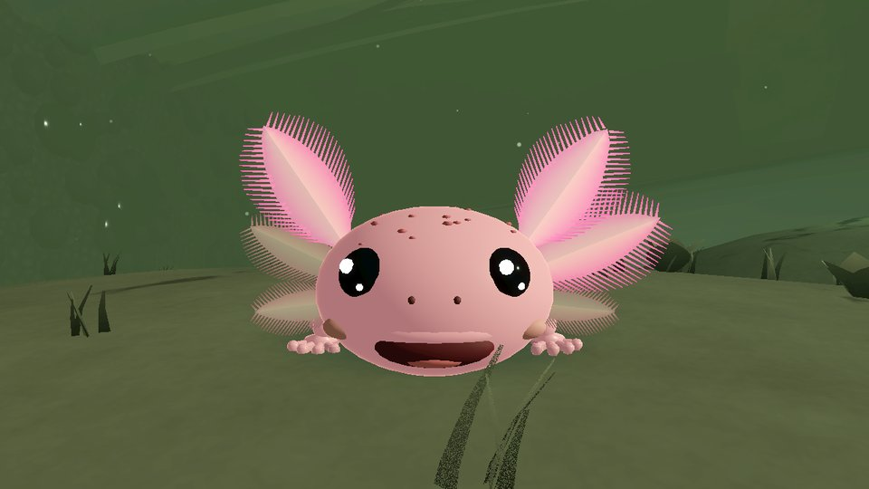
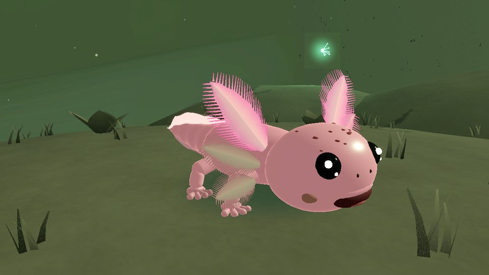
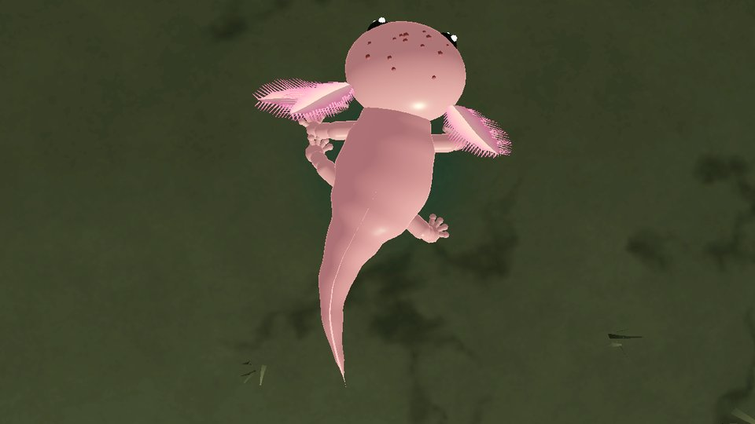
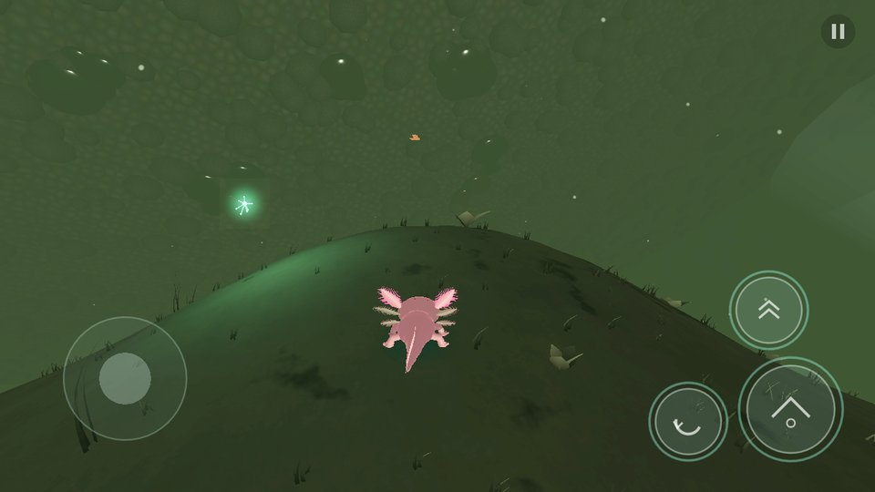
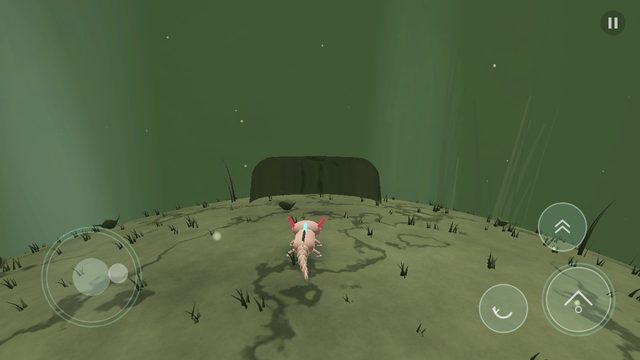
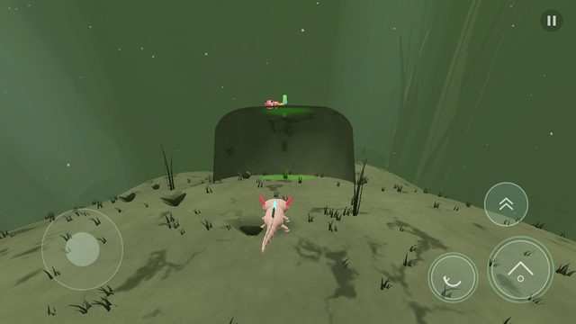
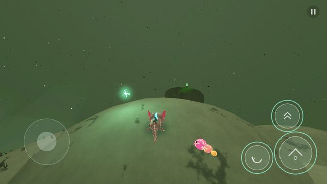
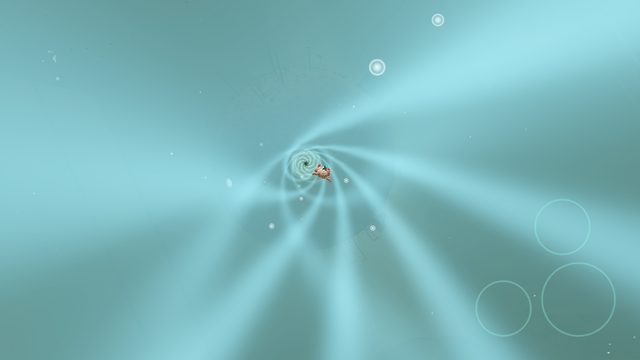
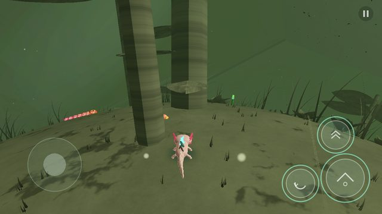
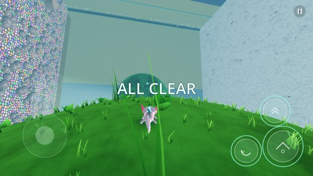

# Axolotl

*Moss balls 4 life.*

A mobile 3D third-person platforming proof of concept (Android + iPhone, landscape) set inside one
household aquarium. A tiny axolotl lives on three giant moss balls and keeps them healthy: parasites
are eating his moss, so he deals with them, catches Regeneration Motes, eats, explores, and — without
anyone explaining it — slowly cleans up the whole tank.

* Engine: **Godot 4.7.2** (Mobile renderer, GDScript). No plugins, no accounts.
* Game version **v0.1.0**, shown on the title screen. Its single source is `scripts/core/game_version.gd`, and
  it is independent of APK builds, OTAs and commits (see [docs/VERSIONING.md](docs/VERSIONING.md)).
* Two Android builds:
  * **Axolotl**, the normal build. It is fully offline and has no network permission.
  * **Axolotl Dev**. It installs alongside the normal build and receives signed over-the-air game updates from the dev channel, so it needs no reinstall per change (see [docs/OTA.md](docs/OTA.md)).
* Art and audio are **100% original and procedural**: meshes are built in code at load time,
  textures come from `tools/gen_textures.py`, and all music and sound comes from the synthesizer in
  `tools/gen_audio.py` (both are committed outputs, so the build doesn't need Python).
* A straightforward first completion (300% restored) takes roughly 8–12 minutes.

---

## Build & run

### Requirements
* Godot **4.7.2 stable** editor, plus the matching export templates (Editor → Manage Export Templates).
* Android: Android SDK (platform-tools + build-tools), JDK 17, and a debug keystore configured in
  *Editor Settings → Export → Android*.
* iOS: a Mac with Xcode 15+; an Apple Developer team ID for device builds.

### Play on desktop (fastest way to try it)
```bash
godot --path .            # or open project.godot in the editor and press Play
```
The mouse emulates touch, so the on-screen controls work with clicks and drags.

### Android
```bash
godot --headless --path . --import
godot --headless --path . --export-debug "Android" build/android/axolotl-debug.apk
adb install -r build/android/axolotl-debug.apk
```
The `Android` preset exports a signed **debug** arm64 APK (`com.verbal76.axolotl`), landscape only, with the
VIBRATE permission and no INTERNET permission. The OTA client is inert in this build.

The `Android Dev` preset (`com.verbal76.axolotl.dev`, "Axolotl Dev") adds INTERNET and the `ota_dev`
feature, which turns on the OTA client. Install it once and update it over the air afterwards; see
[docs/OTA.md](docs/OTA.md).

### iOS
```bash
godot --headless --path . --import
godot --headless --path . --export-debug "iOS" build/ios/Axolotl.ipa   # writes build/ios/Axolotl.xcodeproj
open build/ios/Axolotl.xcodeproj
```
In Xcode, set your signing team (replace the placeholder team `AXOLOTL000` in `export_presets.cfg`,
or in Xcode's *Signing & Capabilities*), pick a device or simulator, and run. For an unsigned
Simulator build from the command line:
```bash
cd build/ios && xcodebuild -project Axolotl.xcodeproj -scheme Axolotl -sdk iphonesimulator \
  -destination 'generic/platform=iOS Simulator' CODE_SIGNING_ALLOWED=NO build
```

### Continuous integration
`.github/workflows/build.yml` runs on pull requests (and pushes to `main`). It is the **native build**:
1. **verify**:
   - compiles every script;
   - runs the mechanics suite and the beginning-to-end playthrough bot headless;
   - runs the version-drift regression and the native-runtime lock check;
   - uploads the results.
2. **android** exports both APKs:
   - Android build (versionCode) = the run number;
   - both are signed with the stable dev keystore when the `ANDROID_DEV_KEYSTORE_B64` secret is set;
   - it checks that the normal APK has no INTERNET permission and the dev APK has it;
   - it uploads `axolotl-android-v<game>-b<build>` and `axolotl-android-dev-v<game>-b<build>` with a `build-info.json`.
3. **ios** exports the Xcode project on macOS, builds it for the iOS Simulator (unsigned), and
   uploads the `.app` as `axolotl-ios-simulator-app`.

`.github/workflows/ota-publish.yml` is the **OTA publish**. It runs on pushes to the development branch.
- It runs the tests, exports the game-layer PCK and signs its manifest.
- It publishes an immutable release and moves the `dev` channel pointer.
- It does not build an APK.
- It writes a publication receipt with the source SHA, runtime, OTA id and PCK hash.

### Automated verification (local)
```bash
godot --headless --path . --fixed-fps 60 --max-fps 0 -- --test=unit          # mechanics suite
godot --headless --path . --fixed-fps 60 --max-fps 0 -- --test=playthrough   # full playthrough bot
godot --path . --fixed-fps 60 -- --test=shots --out=/tmp/shots               # rendered screenshots
godot --headless --path . -s tools/check_scripts.gd                          # compile check
GODOT=godot tools/version_drift_check.sh                                     # product-version drift
GODOT=godot tools/ota_e2e_local.sh                                           # full OTA loop (needs Linux templates)
python3 tools/ota_runtime.py --check                                         # native layer unchanged?
```
Add `--only=<name>` to the unit run to run a single test.

---

## Controls

| Action | Touch (landscape) | Controller | Keyboard (desktop testing) |
|---|---|---|---|
| Move | Left thumb: floating virtual stick | Left stick | WASD / arrows |
| Camera | Swipe on the right side of the screen | Right stick | Q / E / R / F |
| Jump → (in air) **water burst** | Big button (bottom right) | A / Cross | Space |
| Tail swipe | Left button | X / Square | J |
| Lunge (feed / catch Motes) | Upper button | B / Circle | K |
| Pause | ‖ button (top right) | Start / Options | Esc / P |

* The second jump press in the air is a **directional water burst** that follows the stick. It's
  available once per airborne sequence and resets on landing. There is no double jump, no dodge
  button, no meter.
* Touch controls fade out when a controller is used and come back on the next touch.
* **Pause → Reduced HUD** fades the persistent controls almost to invisible; the touch zones keep working.
* Pause also has music/sound levels, haptics on/off, controller/touch status, Restart Experience and
  Return to Title.

---

## Implemented mechanics (what's in the build)

**Movement & camera** — sphere-centred gravity on every moss ball, where the axolotl's "up" follows the
surface and the tank never rotates. Also: camera-relative movement with acceleration/deceleration,
a push-off jump, coyote time (0.12 s), jump buffering (0.15 s), and the directional water burst. The
assisted over-the-shoulder camera eases its "up" toward local gravity and carries its yaw across the
sphere, so it never flips at the poles. It also pulls in when obstructed and can be swiped manually.

**The axolotl** — modelled on the owner's reference art: a big round smiling head with glossy eyes and
freckles, six feathery pink gills, and chubby four-fingered hands.
- **Body:** one smooth skinned body on an 11-bone spine. As he moves, a snake-like S-wave travels down it, stronger toward the tail.
- **Legs:** they ride that wave and step in the diagonal salamander gait, timed to the body bends.
- **Air:** he tucks his legs back and undulates like a swimming axolotl, and a burst whips the whole body.

Personality animations: perk up, happy wiggle when life returns nearby, head/gill
shake after hits, looking at things, mouth open when zooming, and bracing on a dangerous fall. There
are four superhero-landing variants (fist plant, gill shake, awkward tip-and-play-it-off,
look-at-camera wink) that share one hitbox.

**Health** — shown on his six feathery external gills, three per side off the back of the head.
- 3 start active (vivid glowing pink) and 3 dormant (pale).
- Damage turns one pale and droopy, with a flinch, a pulse on the others, and brief invulnerability.
- At one gill the last one pulses irregularly. There's no vignette, alarm or limp. Food 1 heals +1, food 2 heals +2, food 3 heals
everything, and you can eat at full health. Three cave upgrades take you from 3 to 6.

**Food** — the drifter rides currents; the darter senses you, hops, then pauses; the burrower peeks
out, retreats when disturbed (a short catch window) and re-emerges later. New food drifts or swims in
from out of view, or emerges from moss. The mix differs per moss ball.

**Regeneration Motes** — small living spore organisms with real local light: the three nearest get
true omni lights, and a cheap shader term lights moss, plants and particulate. They wander a
small patch, get nudged by water, need a lunge to catch, and dive into the moss to restore it. A near
miss pushes them away like a floating toy in a pool.

**Parasites** — small (1 hit, leap/latch), medium (2 hits) and large (3 hits, readable
rear-and-snap telegraph, knockback/partial dislodge). Their health is shown only by colour draining
from head to rear. A kill returns vitality to the moss; the body loses its grip and drifts away, then
hands off to a cheap drifting speck (never popped). No respawns.

**Combat** — a tail swipe covering 270° (everything except a 90° cone straight ahead), on the ground or in the air. If the nearest parasite in reach is in front, he whips round up to 60° so it lands inside the sweep.
Hard landings make a small pressure wave (kills small, one stage plus knockback on larger). The
extreme canopy drop on Moss Ball #3 costs one segment but never the last, uses a bigger radius, and
deals two stages. Dangerous falls are telegraphed only by body language and water streaming.

**Checkpoints & regeneration** — touching a moss bloom opens it and makes it the respawn point. On
death he dissolves into glowing particles that travel back to the bloom and reform with full health.
Restoration and kills persist.

**Restoration** — each moss ball tracks 0–100% internally (never shown). Every Mote and parasite
restores a local patch, and finishing a patch blooms it fully. Brittle moss crumbles underfoot and
becomes solid once its patch is restored.

**Vortices** — each vortex strengthens continuously with its ball's restoration: the whirlpool grows
and the tunnel physically extends toward the next moss ball, pulsing on each restoration. At about
70% it connects, with a restrained cue and a short camera shot and no text. Connected tunnels stay
open and work both ways. Travel is a cinematic where the axolotl surfs the spiral, banking, limbs out,
gills streaming, and grinning.

**The aquarium** — everything is continuous in total restoration, with no tiers: water clarity,
murk particles, gravel cleanliness and colour, ooze pockets, algae on the glass, light, and how much
of the bedroom you can see. Music layers enter gradually and the muffling filter opens. Unexplained
bedroom sounds (footsteps, a drawer, a door, something set down) are louder while the tank is dirty
and recede as it clears. Incidental legs and a hand may pass outside; no face, no acknowledgement.

**Moss Ball #1 (classic marimo)** — the tutorial: walk, jump, water burst, swipe, restore, bloom,
then a gentle framing shot showing the rest of the ball is still sick. Rolling hills, a brittle-moss
tower, a hidden cave.

**Moss Ball #2 (current-swept overgrowth)** — an equatorial current band that speeds you with the
flow and slows you against it (walking and jumping), shown only by bending grasses and drifting
particles. A mesa reached only by riding current-swayed living plants. The current carries
knocked-off parasites downstream until they re-latch.

**Moss Ball #3 (underwater jungle)** — a dense stem forest that hides the tank, a spiral climb to a
traversable upper canopy, flexible lower leaves that bend deeply to cushion falls (one rebounds
modestly and flings parasites), and the extreme drop into a clearing.

**Completion** — once all three balls reach 100%, the whole tank is clean. After about 12 seconds of
quiet, a restrained **ALL CLEAR** fades in and out. You keep control and can roam, eat, revisit caves
and surf vortices; leave via Pause.

**Mobile** — landscape only, safe-area and notch aware HUD layout, touch and controller switching,
optional restrained haptics, fully offline. Quiet performance scaling steps down resolution scale,
particle count, vegetation density, glow and secondary lights when the frame rate sags, and recovers
slowly. It never touches controls, camera or gameplay effects.

## Project layout
```
scenes/main.tscn            single scene; everything is built by scripts
scripts/core/               game orchestration, settings/input, audio director, quality scaler
scripts/actors/             axolotl (controller + procedural model), parasites, food, motes, blooms
scripts/world/              moss balls, level content, aquarium/bedroom, vortex, platforms, water FX
scripts/camera/, ui/        follow camera, HUD, title, pause menu
scripts/tests/              unit suite, playthrough bot, screenshot tour (only run via --test=)
shaders/                    moss health field, vegetation, parasites, glass, gravel, vortex, particles
tools/                      texture + audio generators, script checker
```

## Screenshots
Rendered by the engine in this project's automated screenshot tour (software GPU, 1280×720, downscaled).
The first two rows show the current character and terrain. The rest predate the character redesign and
smooth hills, so they show the earlier, simpler axolotl.

| | |
|---|---|
|  |  |
|  |  |
|  |  |
|  |  |
|  |  |

## Verification results

How it was verified: **no physical phone or tablet was available** in the build environment. Everything
below comes from running the real game in Godot 4.7.2: headless for logic, and on a software Vulkan GPU
(llvmpipe) for screenshots. The CI builds prove the Android APK exports and the iOS app compiles, but
neither was installed or run on a device or simulator.

**Mechanics suite** (`--test=unit`, 119 checks, all passing locally and in CI). These drive the real
controller through the same input actions the touch HUD and gamepad use:
- All 118 authored actors land on their intended surface.
- Moss cushions, stems and cave domes face the right way, so no platform renders hollow or see-through.
- The rolling hills are smooth and gentle: max slope 0.39, crest heights as authored, and collision within 7 mm of the drawn surface. He walks up and over a hill without leaving the ground.
- OTA client, and version/identity separation: 40 checks, listed in [docs/OTA.md](docs/OTA.md) and [docs/VERSIONING.md](docs/VERSIONING.md).
- Tutorial route: every start point makes jump → M1 → jump+burst → M2, and a plain jump cannot cross the gap.
- A full lap around a moss ball with no camera flips and no unintended airborne frames.
- Jump apex, the water burst (exactly once, follows direction, no third action), landing resets it, coyote time, jump buffering.
- The swipe spares only the 90° cone ahead, hits across the rest of its 270° arc, and turns up to 60° to reach a parasite dead ahead; 1/2/3-hit colour drain in the right stages, draining head to rear; dead parasites drift, then hand off to debris.
- Hard landing kills small parasites and does one stage plus knockback to medium ones. The extreme canopy drop costs 1 health, never the last one, and deals 2 stages, with a visible telegraph. The flexible leaf cushions the fall and gives a modest rebound.
- Food heals +1, +2 and full, and works at full health. The darter darts, the burrower retreats and re-emerges, and food repopulates out of view.
- Motes aren't auto-collected, are pushed by a near miss, need the lunge, and restore the patch.
- Blooms activate; regeneration returns you to the last bloom with full health and keeps restoration.
- Brittle moss crumbles and regrows.
- The aquarium and vortex change continuously (largest per-frame step 0.0002 and 0.0013), with no tiers.
- The vortex stays closed below 70%, connects at 70% with its camera shot, and works in both directions.
- The current changes walking and jumping distance and carries knocked parasites downstream.
- Three cave upgrades take health to 6.
- Pause, Reduced HUD, touch/controller switching and haptics toggle all work.
- 300% restoration shows ALL CLEAR only after the quiet period, and free roam continues.

**Beginning-to-end playthrough** (`--test=playthrough`). A bot plays from the title screen using
only the same analog stick and button actions a player produces. It never teleports the axolotl
or edits game state. Latest local run (seeded), all 12 checks passing:
- Tutorial completed in 12.7 s of game time; the bloom checkpoint activated.
- Moss Ball #1 restored to 79%. Its vortex opened with the connection shot; travel to #2.
- Moss Ball #2 fully restored (mesa via current-swayed plants, brittle tower, cave); travel to #3.
- Moss Ball #3 fully restored (spiral climb, canopy, **extreme canopy drop**, cave).
- Backtracked #3 → #2 → #1 and finished #1. **300% restored, ALL CLEAR shown, then free roam.**
- 30 parasites killed, 34 Motes captured, 3 upgrades, 0 deaths in that run. Other runs hit deaths and
  regenerated correctly.

The bot's early runs uncovered real bugs, all fixed:
- World-space placement errors on moss balls #2 and #3.
- A canopy leaf with no headroom above the spiral climb.
- Actors inside the cave dome footprint.
- A too-tight tutorial burst gap.
- The parasites' ability to walk off platforms.
- Vortex suction pulling in an axolotl that was just nearby.

## Performance observations (measured here; not measured on a phone)
- **CPU:** the whole engine, including all gameplay scripts, averages **~1.1–1.2 ms per frame** headless
  on this x86 container, with the worst frame around 13–29 ms during level loading or the bot's heavy
  raycasting (about 0.5 ms average on the CI runner). The player controller costs about 0.25 ms and
  parasites up to about 0.4 ms. This leaves a large budget at 60 FPS even allowing for phones being 3–6× slower.
- **Rendering:** 190–350 draw calls and about 170k–390k triangles per frame across the key views, after
  merging multi-part meshes and adding distance culling (down from 300–820 draw calls).
- **GPU cost on mobile is untested.** The frame rate on real Android and iPhone hardware still needs
  measuring. The quality scaler steps down resolution scale, particle count, vegetation density,
  glow and secondary Mote lights if the frame rate stays below 54 for about 4 s, and recovers slowly.

## Known limitations
- **Little on-device testing.** The owner has played an early APK once, and that session produced the platform-winding,
  swipe-arc and terrain feedback. Haptics, safe areas, thermal behaviour and real frame rates are
  still unmeasured on hardware.
- **The OTA loop is proven on an exported desktop build, not yet on a phone.** `tools/ota_e2e_local.sh`
  covers download, verify, restart, second OTA, corrupt-package rejection, rollback, baseline mode and
  unhealthy-OTA fallback. On Android, installing the Dev APK and restarting it is still to be done.
- The iOS preset uses a placeholder team ID (`AXOLOTL000`); set your own for device builds. The CI
  iOS build is an unsigned **Simulator** build.
- Both Android builds are debug APKs. They are signed with the stable dev keystore from secrets, or with a throwaway key if the secret is missing. There is no release signing.
- Art is deliberately simple procedural geometry (primitives, instanced blades, shader-driven moss).
  Animation is procedural rather than hand-keyed.
- Music and sound are procedurally synthesized placeholders of reasonable quality, not composed and mixed audio.
- The playthrough bot is a verification tool, not a human. Its route times, especially the
  12.7 s tutorial with a perfect run-up, are not estimates of human play time.
